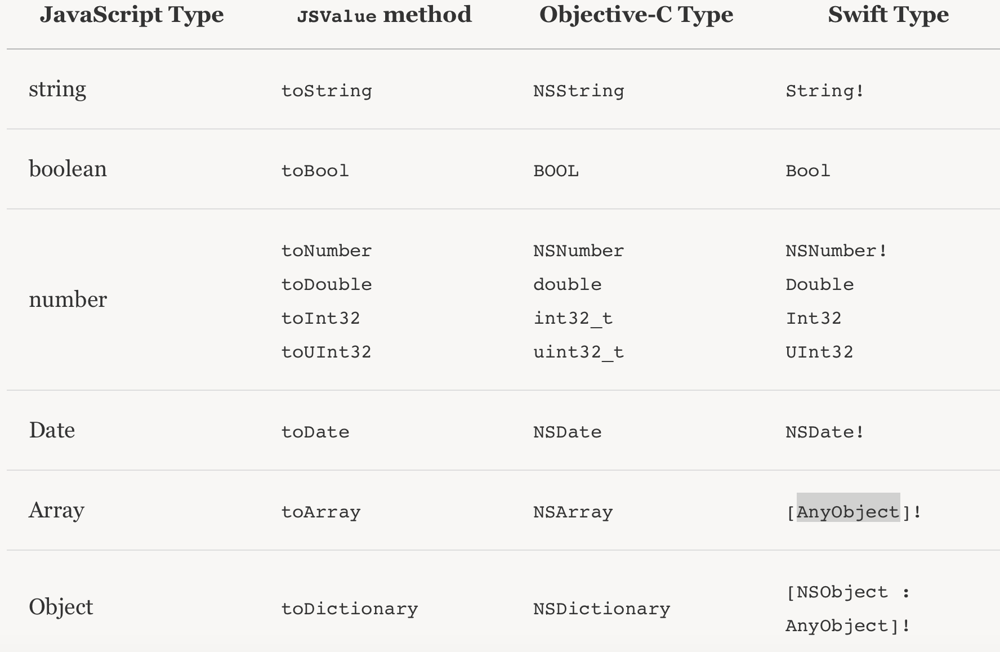
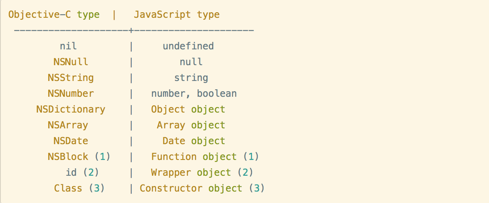
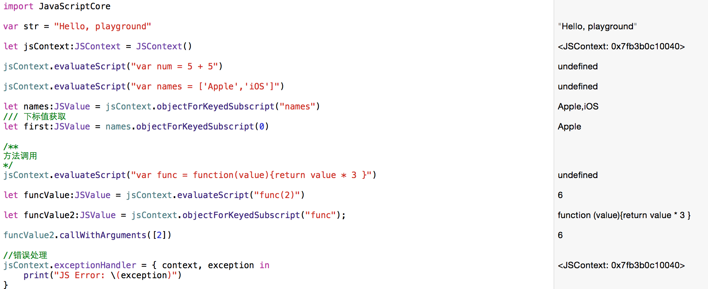
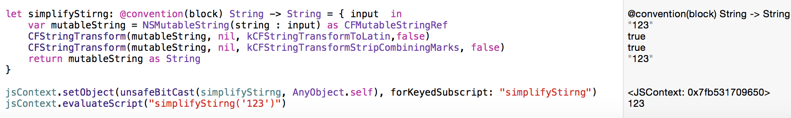

###前生后世
&emsp;&emsp;JavaScriptCore 是苹果 Safari 浏览器的JavaScript 引擎，在 OS X 平台上很早就存在的，而在 iOS 平台，直到IOS7才对外开放，并提供了 Objective-C 的接口,极大的方便了我们对js的操作。我们可以脱离webview直接运行我们的js。iOS7以前我们对JS的操作只有webview里面一个函数 stringByEvaluatingJavaScriptFromString，JS对OC的回调都是基于URL的拦截进行的操作。大家用得比较多的是[WebViewJavascriptBridge](https://github.com/marcuswestin/WebViewJavascriptBridge)和[EasyJSWebView](https://github.com/dukeland/EasyJSWebView)这两个开源库，很多混合都采用的这种方式。<br/>
&emsp;&emsp;JavaScriptCore是webkit的一个重要组成部分，主要是对JS进行解析和提供执行环境。代码是开源的，可以下下来看看[源码](https://github.com/phoboslab/JavaScriptCore-iOS)）。

###全家桶
&emsp;&emsp;首先引入框架   #import <JavaScriptCore/JavaScriptCore.h><br/>
主要包括以下五个类<br/>

	#import "JSContext.h" <br/>
	#import "JSValue.h" <br/>
	#import "JSManagedValue.h"<br/>
	#import "JSVirtualMachine.h"<br/>
	#import "JSExport.h"<br/>

#####JSContext.h
&emsp;&emsp;一个 Context 就是一个 JavaScript 代码执行的环境，也叫作用域。
同时也通过JSVirtualMachine管理着所有对象的生命周期，每个JSValue都和JSContext相关联并且强引用context。
#####JSValue.h
&emsp;&emsp;JS是弱类型的，ObjectiveC是强类型的，JSValue被引入处理这种类型差异，在 Objective-C 对象和 JavaScript 对象之间起转换作用;另外，每个JSValue都是强引用一个context。<br/>
以下是JS OC  Swift 类型对应图例


#####JSManagedValue.h
&emsp;&emsp;JS和OC对象的内存管理辅助对象。由于JS内存管理是垃圾回收，并且JS中的对象都是强引用，而OC是引用计数。如果双方相互引用，势必会造成循环引用，而导致内存泄露。我们可以用JSManagedValue保存JSValue来避免。
#####JSVirtualMachine.h
&emsp;&emsp;JS运行的虚拟机，有独立的堆空间和垃圾回收机制。
#####JSExport.h
&emsp;&emsp;在 JavaScript 代码中使用我们的自定义对象的方法是添加 JSExport 协议。无论我们在 JSExport 里声明的属性，实例方法还是类方法，继承的协议都会自动的提供给任何 JavaScript 代码。

###通信
• Objective-C or swift → JavaScript  <br/>
• JavaScript → Objective-C  or swift
#####swift → JavaScript
大致步骤如下：<br/>
+ 创建JSContext对象(可以设置异常处理)<br/>
+ 加载JS代码<br/>
+ 访问JSVAlue<br/>

#####JavaScript → swift
JSContext 访问我们的本地客户端代码的方式主要有两种：block 和 JSExport 协议。
######block
&emsp;&emsp;当一个 Objective-C block 被赋给 JSContext 里的一个标识符，JavaScriptCore 会自动的把 block 封装在 JavaScript 函数里。这使得在 JavaScript 中可以简单的使用 Foundation 和 Cocoa 类，所有的桥接都为你做好了。
***Note***<br/>
1.内存管理：由于 block 可以保有变量引用，而且 JSContext 也强引用它所有的变量，为了避免强引用循环需要特别小心。避免保有你的 JSContext 或一个 block 里的任何 JSValue。相反，使用 [JSContext currentContext] 得到当前上下文，并把你需要的任何值用参数传递。简单的说 jsvalue = [valueWithObject:inContext:[JSContext currentContext]]<br/>
2.swift:要在 JSContext 中使用 Swift 闭包，它需要（a）与 @ objc_block 属性一起声明，以及（b）使用 Swift 那个令人恐惧的 unsafeBitCast() 函数转换为 AnyObject ***。


######JSExport
在 JavaScript 代码中使用我们的自定义对象的方法是添加 JSExport 协议。无论我们在 JSExport 里声明的属性，实例方法还是类方法，继承的协议都会自动的提供给任何 JavaScript 代码。[Mustache JS library](http://mustache.github.io)

***note***<br/>
唯一要注意的是OC的函数命名和JS函数命名规则问题。
		#define JSExportAs(PropertyName, Selector) \
    	@optional Selector __JS_EXPORT_AS__##PropertyName:(id)argument; 
    	@required Selector
    	#endif

比如：协议中定义的是add: b:，但是JS里面方法名字是addB(a,b)。可以通过JSExportAs这个宏转换成JS的函数名字。<br/>
JSExportAs(add, - (NSInteger)add:(NSInteger)a b:(NSInteger)b);

###内存管理
1• Objective-C uses ARC（OC 使用ARC机制）<br/>
2• JavaScriptCore uses garbage collection （JS 使用垃圾回收机制）<br/>
              ■ All references are strong （JS中全部都是“强引用”）<br/>
3• API memory management is mostly automatic <br/>
4• Two situations that require extra attention: （几乎SDK已经做好了很多事情，所以开发者只需要重点掌握以下亮点）<br/>
              ■ Storing JavaScript values in Objective-C objects <br/>
              ■ Adding JavaScript fields to Objective-C objects
              
  ***根据官方文档关于JS－OC内存管理总结：由于JS中全部都是强引用，如果JS 与 OC互相引用时，就要防止OC也强引用JS，这样会形成引用循环，所以OC要想办法弱引用，但弱引用会被系统释放，所以把可能被释放的对象放到一个容器中来防止对象被被错误释放。***
  
***
1.不要在block里面直接使用context，或者使用外部的JSValue对象。<br/>
如果需要引用，jsvalue = [valueWithObject:inContext:[JSContext currentContext]]
***
2.OC对象不要同时引用同一个对象，因为这样太容易循环引用了<br/>

解决方案：<br/>
JSManagedValue：<br/>
 &emsp;&emsp;The primary use case for JSManagedValue is for safely referencing JSValues   from the Objective-C heap. It is incorrect to store a JSValue into an   Objective-C heap object, as this can very easily create a reference cycle,  keeping the entire JSContext alive.<br/> 
（将 JSValue 转为 JSManagedValue 类型后，可以添加到 JSVirtualMachine 对象中，这样能够保证你在使用过程中 JSValue 对象不会被释放掉，当你不再需要该 JSValue 对象后，从 JSVirtualMachine 中移除该 JSManagedValue 对象，JSValue 对象就会被释放并置空。）

&emsp;&emsp;JSVirtualMachine： All instances of JSContext are associated with a single JSVirtualMachine. The  virtual machine provides an "object space" or set of execution resources.<br/>
（JSVirtualMachine就是一个用于保存弱引用对象的数组，加入该数组的弱引用对象因为会被该数组 retain，所以保证了使用时不会被释放，当数组里的对象不再需要时，就从数组中移除，没有了引用的对象就会被系统释放。）<br/>

&emsp;&emsp;JSManagedValue 帮助我们保存JSValue，那里面保存的JS对象必须在JS中存在，同时 JSManagedValue 的owner在OC中也存在。我们可以通过它提供的两个方法。<br/>
		 
    + (JSManagedValue )managedValueWithValue:(JSValue )value;<br/>

	-(JSManagedValue )managedValueWithValue:(JSValue )value andOwner:(id)owner创建JSManagedValue对象。<br/>
	
	通过JSVirtualMachine的方法- (void)addManagedReference:(id)object withOwner:(id)owner来建立这个弱引用关系。
	通过- (void)removeManagedReference:(id)object withOwner:(id)owner``` 来手动移除他们之间的联系。
	
***使用方式***
    
    _managedValue = [JSManagedValue managedValueWithValue:jsValue];

    [[[JSContext currentContext] virtualMachine] addManagedReference:_managedValue 
    withOwner:self];
    
  
###线程安全
• API is thread safe<br/>
• Locking granularity is JSVirtualMachine<br/>
          ■ Use separate JSVirtualMachines for concurrency/parallelism
	
JavaScriptCore 线程是安全的，每个context运行的时候通过lock关联的JSVirtualMachine。<br/>
如果要进行并发操作，可以创建多个JSVirtualMachine实例进行操作。
##JavaScriptCore C API
####JSValue ↔ JSValueRef ：
       JSValueRef valueRef = XXX;
       JSValue *value = [JSValue valueWithJSValueRef:valueRef inContext:context];

       JSValue *value =  XXX;
       JSValueRef valueRef = [value JSValueRef];

####JSContext ↔ JSGlobalContextRef ：
        JSGlobalContextRef ctx =  XXX;
        JSContext *context = [JSContext contextWithJSGlobalContextRef:ctx];

        JSContext *context =  XXX;
        JSGlobalContextRef ctx = [context JSGlobalContextRef];
##与UIWebView的操作
 self.context = [webView valueForKeyPath:@"documentView.webView.mainFrame.javaScriptContext"];


###参考我文章
+ <http://nshipster.cn/javascriptcore/>
+ <http://blog.csdn.net/lizhongfu2013/article/details/9232129>
+ <https://developer.apple.com/videos/play/wwdc2013/615/>
